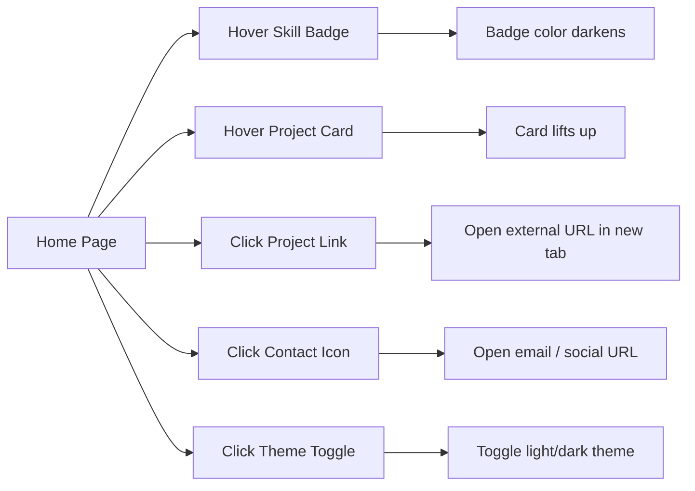

# PRD: Personal Profile Page

## 1. Executive Summary
A single-page, static personal profile website that presents an individual's professional identity, skills, projects, and contact information in a clean, responsive layout. The page serves as a lightweight online resume or portfolio, viewable by anyone without authentication or server-side logic.

## 2. Problem & Solution
| Pain Point | Solution |
|-----------|----------|
| No quick, shareable way to present one's professional summary | A single static page that loads instantly and works on all devices |
| Need for a simple online presence without backend complexity | Pure front-end implementation (HTML + CSS + optional JS) |
| Visitors want to quickly assess skills and contact options | Well-structured sections with clear hierarchy and one-click contact links |

## 3. Goals & Non-Goals
### Goals (v1.0)
- Deliver a fully responsive, mobile-first static page.
- Showcase name, photo, short bio, skills, featured projects, and contact methods.
- Ensure all external links (social, email) open correctly.
- Achieve a professional visual design with consistent spacing and typography.
- Load in under 2 seconds on a standard 4G connection.

### Non-Goals
- No user authentication, forms, or dynamic content.
- No backend API or database.
- No analytics or tracking.
- No multi-page navigation (single page only).

## 4. Feature Requirements
### Profile Display
- **FR-PR-01** (P0): Display the person's full name prominently at the top of the page.
- **FR-PR-02** (P0): Show a professional headshot (or avatar placeholder) with a circular crop.
- **FR-PR-03** (P0): Render a short bio paragraph (≤150 words) below the name/photo.
- **FR-PR-04** (P1): Display a list of technical skills (e.g., JavaScript, Python, React) as tags/badges.
- **FR-PR-05** (P1): Show a list of featured projects – each with title, short description, and optional link.
- **FR-PR-06** (P0): Provide clickable icons/links for email, LinkedIn, GitHub, and Twitter.

### Visual & Interaction
- **FR-VI-01** (P0): Use a responsive grid layout that adapts from single-column (mobile) to two-column (desktop).
- **FR-VI-02** (P1): Apply subtle hover effects on skill badges and project cards (e.g., slight scale/color change).
- **FR-VI-03** (P1): Smooth scrolling for any internal anchor links (if present).
- **FR-VI-04** (P2): Add a dark/light theme toggle (CSS custom properties + JavaScript).

## 5. Pages & Screens
### 5.1 Home Page (only page)
- **URL / Route**: `/` (root)
- **Access**: public
- **Purpose**: Present the user's personal profile in a single, scrollable view.
- **Layout**: Vertical single-page layout with the following regions (top to bottom):
  1. **Hero section**: centered name, headshot, and bio.
  2. **Skills section**: grid/badge area.
  3. **Projects section**: card grid.
  4. **Contact section**: icon row + optional email link.
  5. **Footer**: copyright line (optional).
- **Key Elements**:
  - **Name heading**: `<h1>` at top center, large font.
  - **Profile photo**: `` with `border-radius: 50%`, default state shows placeholder if image fails.
  - **Bio paragraph**: `
` with max-width, centered.
  - **Skill badges**: inline `` elements with background color, rounded corners.
  - **Project cards**: `
` with shadow, hover lift effect.
  - **Contact icons**: `<a>` tags wrapping SVG icons.
  - **Theme toggle**: button/switch in top-right corner (optional).
- **Interactions**:
  | Trigger | Action | Result / Feedback |
  |---------|--------|-------------------|
  | Click skill badge | None | No action (static display) |
  | Hover over skill badge | CSS `:hover` | Background color darkens slightly, cursor changes to pointer |
  | Hover over project card | CSS `:hover` | Card elevates (box-shadow increase, translateY(-2px)) |
  | Click project card link | Navigate to external URL | Opens in new tab (`target="_blank"`) |
  | Click contact icon | Navigate to external URL | Opens in new tab (email: opens default mail client) |
  | Click theme toggle | JavaScript toggles class on `<html>` | All colors switch between light/dark palette |
- **States**:
  - **Loading**: No loading state (static page loads instantly). Image may show placeholder while loading.
  - **Empty**: Not applicable – all content is hardcoded.
  - **Error**: If image fails to load, show `alt` text or a fallback SVG avatar.
  - **Success**: Full page rendered with all sections visible.
- **Layout regions** (ordered top → bottom):
  - Header bar (optional theme toggle + empty space)
  - Hero section (name, photo, bio)
  - Skills section (section heading + badge grid)
  - Projects section (section heading + card grid)
  - Contact section (section heading + icon row)
  - Footer (copyright text)
- **On-screen inventory**:
  - `<h1>` – Full name (e.g., "Jane Doe")
  - `` – Profile photo (circular)
  - `
` – Short bio
  - `<h2>` – "Skills" section heading
  - Multiple `` – Skill badges (e.g., "React", "Python")
  - `<h2>` – "Projects" section heading
  - Multiple `
` – Project cards (each contains title `<h3>`, description `
`, link `<a>`)
  - `<h2>` – "Contact" section heading
  - Multiple `<a>` – Social/email icons (SVG or text)
  - `<button>` – Theme toggle (optional)
  - `<footer>` – Copyright notice

## 5.3 Interaction overview (Mermaid diagram)

## 5.4 Interactive components index

| ID | Page | Component | Type | User interaction | Effect (feedback + outcome) |
|----|------|-----------|------|------------------|-----------------------------|
| IC-01 | Home | Skill badge | `` | Hover | Background color darkens; cursor changes |
| IC-02 | Home | Project card | `
` | Hover | Box-shadow increases; card translates up 2px |
| IC-03 | Home | Project link | `<a>` | Click | Opens linked URL in new browser tab |
| IC-04 | Home | Contact icon (email) | `<a href="mailto:...">` | Click | Opens default email client with pre-filled address |
| IC-05 | Home | Contact icon (social) | `<a href="..." target="_blank">` | Click | Opens social profile in new tab |
| IC-06 | Home | Theme toggle | `<button>` | Click | CSS class toggled on `<html>`; all colors switch between light/dark |

## 6. Key User Stories
| ID | As a... | I want to... | So that... |
|----|---------|-------------|-----------|
| US-01 | Visitor | See the person's name and photo immediately | I can quickly identify who the page is about |
| US-02 | Recruiter | View a list of technical skills | I can assess fit for a role without reading a long resume |
| US-03 | Potential collaborator | See featured projects with descriptions | I can understand the person's work style and expertise |
| US-04 | Hiring manager | Click to visit LinkedIn or GitHub | I can verify experience and see more examples |
| US-05 | Mobile user | Have the page look good on my phone | I can browse comfortably without zooming |
| US-06 | Returning visitor | Toggle between light and dark mode | I can view the page in my preferred theme |

## 7. Acceptance Criteria
| ID | Feature / Story Ref | Criterion | How to Verify |
|----|---------------------|-----------|---------------|
| AC-01 | FR-PR-01 | Name is displayed as the first visible heading in the hero section | Open page; confirm `<h1>` contains the correct name text |
| AC-02 | FR-PR-02 | Profile photo has `border-radius: 50%` and is centered above the bio | Inspect element; check computed styles |
| AC-03 | FR-PR-03 | Bio paragraph is ≤150 words and renders without overflow | Word count tool; resize browser to smallest width – no horizontal scroll |
| AC-04 | FR-PR-04 | Skill badges appear in a grid/flow layout, each with distinct background color | Visual inspection; confirm at least 3 badges visible |
| AC-05 | FR-PR-05 | Each project card contains title, description, and a clickable link (if provided) | Click each link; verify new tab opens to correct URL |
| AC-06 | FR-PR-06 | Email link opens `mailto:` URI; social links open in new tab with `target="_blank"` | Click email – mail client opens; click social – new tab opens |
| AC-07 | US-01 | Page loads and hero section is fully visible within 2 seconds on 4G throttled network | Chrome DevTools network throttling; measure load time |
| AC-08 | US-05 | On a 375px wide viewport, all content is readable without horizontal scrolling | Resize browser to 375px; check no overflow |
| AC-09 | FR-VI-02 | Hovering over a skill badge changes its background color (darker) | Hover; verify computed `background-color` changes |
| AC-10 | FR-VI-04 | Clicking theme toggle switches between light and dark palettes; toggle state persists via class | Click toggle; inspect `<html>` class; verify CSS variables change |

## 8. Technical Requirements
| Category | Requirement |
|----------|------------|
| Browser Support | Latest two versions of Chrome, Firefox, Safari, Edge |
| Performance | Page must achieve >90 on Lighthouse Performance (mobile) |
| Responsiveness | Layout must work on viewports from 320px to 2560px |
| Accessibility | All images must have `alt` text; interactive elements must be keyboard-focusable |
| Code Quality | No external dependencies (pure HTML/CSS/JS); no build tools required |

## 9. Data Model Overview
No persistent data model is required. All content (name, bio, skills, projects, contacts) is hardcoded directly in the HTML file. The page is fully static and does not interact with any database or API. Changes to content require editing the HTML source.