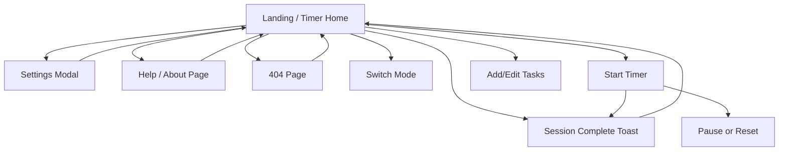

# PRD: Tomato Timer Static Website

## 1. Executive Summary

Tomato Timer is a lightweight static website that helps students, freelancers, and knowledge workers use the Pomodoro technique to manage focus sessions and breaks. The product provides a simple browser-based timer, task tracking, and basic settings without requiring account creation, making it fast to access and easy to use on desktop and mobile.

## 2. Problem & Solution

| Pain Point | Solution |
|-----------|----------|
| Users get distracted and struggle to structure work time | Provide a one-click Pomodoro timer with clear work/break cycles |
| Many timer tools are overly complex or require sign-up | Offer a static website with no login and instant use |
| Users forget what they intended to work on | Add lightweight task input and session labeling |
| Users want small customizations like duration or sound alerts | Include local browser-based settings stored on device |

## 3. Goals & Non-Goals

### Goals (v1.0)
- Deliver a static, responsive Pomodoro timer website with work, short break, and long break modes
- Allow users to start, pause, reset, and switch timer modes
- Support lightweight task entry and current focus labeling
- Persist settings and current session state locally in the browser
- Provide simple progress/history for the current day without backend services

### Non-Goals
- User accounts, cloud sync, or multi-device synchronization
- Team collaboration or shared task boards
- Advanced analytics beyond simple daily session counts
- Native mobile apps
- Calendar integrations or notifications outside the browser

## 4. Feature Requirements

### Timer Module
- **FR-TM01 (P0)**: The system shall display a countdown timer for three modes: Pomodoro, Short Break, and Long Break.
- **FR-TM02 (P0)**: The user shall be able to start, pause, and reset the active timer.
- **FR-TM03 (P0)**: The system shall automatically transition to the next mode when a timer completes, if auto-start is enabled.
- **FR-TM04 (P1)**: The system shall display progress for the current countdown as a visual ring or bar.
- **FR-TM05 (P0)**: The system shall show browser-tab title updates reflecting remaining time and current mode.

### Session Flow Module
- **FR-SF01 (P0)**: The system shall track completed Pomodoro sessions for the current day.
- **FR-SF02 (P1)**: The system shall trigger a long break after a configurable number of completed Pomodoros.
- **FR-SF03 (P1)**: The system shall show the current cycle position (e.g., Pomodoro 2 of 4).
- **FR-SF04 (P2)**: The user shall be able to manually skip to the next session mode.

### Task Module
- **FR-TS01 (P0)**: The user shall be able to enter a current focus task for the active session.
- **FR-TS02 (P1)**: The user shall be able to add, check off, and delete lightweight tasks for the day.
- **FR-TS03 (P1)**: The system shall associate completed Pomodoro counts with tasks entered during the same day.

### Settings Module
- **FR-ST01 (P0)**: The user shall be able to configure Pomodoro, short break, and long break durations.
- **FR-ST02 (P0)**: The user shall be able to enable or disable sound notifications.
- **FR-ST03 (P1)**: The user shall be able to enable or disable auto-start for next sessions and breaks.
- **FR-ST04 (P0)**: The system shall save settings in browser local storage and reload them on revisit.
- **FR-ST05 (P1)**: The user shall be able to restore default settings.

### Notification Module
- **FR-NT01 (P1)**: The system shall play an audible alert when a session ends, if enabled.
- **FR-NT02 (P1)**: The system shall show an in-page completion message when a session ends.
- **FR-NT03 (P2)**: The system shall request optional browser notification permission and show a system notification on completion.

### Persistence Module
- **FR-PS01 (P0)**: The system shall persist timer mode, remaining time, and running/paused state locally during the same browser session.
- **FR-PS02 (P1)**: The system shall persist daily completed session count and tasks in local storage.
- **FR-PS03 (P2)**: The system shall clear or archive daily history when the local date changes.

## 5. Pages & Screens

### 5.1 Landing / Timer Home Page
- **URL / Route**: `/`
- **Access**: public
- **Purpose**: Main experience for running Pomodoro sessions and managing lightweight tasks.
- **Layout**: Top header with logo/title and settings button; central timer card; mode tabs above timer; control buttons below timer; task panel below or beside timer on desktop; small footer at bottom.
- **Key Elements**:
  - Mode tabs: top of timer card, default selected = Pomodoro
  - Countdown display: center of page, large text, default uses saved or default duration
  - Start/Pause button: below timer, default label depends on timer state
  - Reset button: beside Start/Pause, default enabled
  - Focus task input: below controls, empty by default
  - Task list: lower section, empty state shown when no tasks
  - Daily stats summary: near task list, shows completed Pomodoros count
  - Settings icon/button: top-right in header
- **Interactions**:

  | Trigger | Action | Result / Feedback |
  |---------|--------|-------------------|
  | Click mode tab | Switch active mode | Timer display updates to selected mode duration |
  | Click "Start" | Start countdown | Button changes to "Pause", progress animates |
  | Click "Pause" | Pause countdown | Countdown stops, button changes to "Start" |
  | Click "Reset" | Reset current mode timer | Time returns to full duration, subtle status message |
  | Timer reaches 00:00 | Complete session logic | Sound/message shown; count updates; next mode selected if enabled |
  | Enter focus task and press Enter | Save current task label | Task appears as current focus label |
  | Add task via input | Append task to task list | New task row appears |
  | Check task checkbox | Mark task complete | Row appears completed/struck-through |
  | Click delete task | Remove task | Row disappears, optional undo toast |
  | Click settings | Open settings modal | Modal overlays page |
- **States**: loading = brief initial hydration from local storage; empty = no tasks yet and zero completed sessions; error = local storage unavailable or audio playback fails, show inline warning; success = timer running or session completed with confirmation message.
- **Layout regions**:
  - Header
  - Mode selector
  - Timer display card
  - Timer controls
  - Focus task input
  - Daily stats summary
  - Task list panel
  - Footer
- **On-screen inventory**:
  - Logo/site title
  - Settings button
  - Pomodoro tab
  - Short Break tab
  - Long Break tab
  - Countdown text
  - Progress ring/bar
  - Current mode label
  - Start/Pause button
  - Reset button
  - Skip button
  - Current focus input
  - Add task input
  - Add task button
  - Daily completed sessions counter
  - Cycle progress text
  - Task list items
  - Task checkboxes
  - Task delete buttons
  - Completion/status message area
  - Footer text/help link

### 5.2 Settings Modal
- **URL / Route**: `/#settings` or modal state on `/`
- **Access**: public
- **Purpose**: Allow users to customize timer behavior and preferences.
- **Layout**: Centered modal overlay with title, grouped form controls, save/reset actions, and close button; dimmed backdrop behind.
- **Key Elements**:
  - Duration inputs: numeric inputs for Pomodoro, short break, long break
  - Cycle length input: number of Pomodoros before long break
  - Toggle switches: sound, auto-start breaks, auto-start pomodoros, browser notifications
  - Reset defaults button: lower-left
  - Save button: lower-right
  - Close icon: top-right
- **Interactions**:

  | Trigger | Action | Result / Feedback |
  |---------|--------|-------------------|
  | Change duration input | Update form value | Inline validation shown if invalid |
  | Toggle sound | Enable/disable sound setting | Toggle state changes immediately |
  | Toggle notifications | Request permission if needed | Permission result shown inline |
  | Click "Save" | Validate and persist settings | Modal closes, toast confirms saved settings |
  | Click "Reset to Defaults" | Restore default values | Inputs revert to defaults |
  | Click backdrop or close icon | Dismiss modal | Return to timer page without navigation |
- **States**: loading = populate saved settings; empty = not applicable; error = invalid values or blocked notification permission; success = settings saved confirmation.
- **Layout regions**:
  - Modal header
  - Timing settings group
  - Behavior settings group
  - Notification settings group
  - Modal footer actions
- **On-screen inventory**:
  - Modal title
  - Close button
  - Pomodoro duration input
  - Short break duration input
  - Long break duration input
  - Long-break cycle input
  - Sound toggle
  - Auto-start breaks toggle
  - Auto-start pomodoros toggle
  - Browser notifications toggle
  - Validation messages
  - Reset defaults button
  - Save button

### 5.3 Help / About Page
- **URL / Route**: `/about`
- **Access**: public
- **Purpose**: Explain the Pomodoro technique and how to use the website.
- **Layout**: Simple page with header, content sections, FAQ cards, and footer.
- **Key Elements**:
  - Intro section: what Pomodoro is
  - How it works steps: numbered guidance
  - FAQ accordion: common questions
  - Back to timer button: returns user to home page
- **Interactions**:

  | Trigger | Action | Result / Feedback |
  |---------|--------|-------------------|
  | Click FAQ item | Expand/collapse answer | Answer panel opens/closes |
  | Click "Back to Timer" | Navigate to home | User returns to `/` |
- **States**: loading = static content render; empty = not applicable; error = generic static page load failure; success = content visible and navigable.
- **Layout regions**:
  - Header
  - Intro hero
  - Instruction content
  - FAQ section
  - Footer
- **On-screen inventory**:
  - Site title/logo
  - Navigation back link
  - About heading
  - Intro text
  - Step cards
  - FAQ accordion items
  - Back to Timer button
  - Footer links/text

### 5.4 404 Error Page
- **URL / Route**: `/404`
- **Access**: public
- **Purpose**: Handle invalid routes and guide users back to the timer.
- **Layout**: Minimal centered message with primary recovery action.
- **Key Elements**:
  - Error code/title: centered
  - Explanation text: below title
  - Go Home button: prominent CTA
- **Interactions**:

  | Trigger | Action | Result / Feedback |
  |---------|--------|-------------------|
  | Click "Go Home" | Navigate to home page | User lands on `/` |
- **States**: loading = static render; empty = not applicable; error = not applicable beyond route mismatch; success = page displays recovery action.
- **Layout regions**:
  - Centered error content block
- **On-screen inventory**:
  - 404 heading
  - Explanatory text
  - Go Home button

### 5.5 Session Complete Toast / Notification
- **URL / Route**: transient component on `/`
- **Access**: public
- **Purpose**: Provide immediate feedback when a timer session completes.
- **Layout**: Small toast near top-right or top-center; optional browser notification outside page.
- **Key Elements**:
  - Completion message: indicates finished mode and next mode
  - Dismiss button: closes toast
  - Optional action button: start next session immediately if not auto-started
- **Interactions**:

  | Trigger | Action | Result / Feedback |
  |---------|--------|-------------------|
  | Session completes | Show toast | Message appears with animation and optional sound |
  | Click dismiss | Hide toast | Toast disappears |
  | Click action button | Start next session | Timer begins or mode switches |
- **States**: loading = not applicable; empty = hidden by default; error = notification permission denied or sound playback blocked; success = toast visible with correct message.
- **Layout regions**:
  - Toast body
  - Action area
- **On-screen inventory**:
  - Completion text
  - Dismiss icon/button
  - Start next button

## 5.3 Interaction overview (Mermaid diagram)

## 5.4 Interactive components index

| ID | Page | Component | Type | User interaction | Effect (feedback + outcome) |
|----|------|-----------|------|------------------|-----------------------------|
| IC-01 | Landing / Timer Home | Pomodoro tab | Tab button | Click | Activates Pomodoro mode and updates timer duration |
| IC-02 | Landing / Timer Home | Short Break tab | Tab button | Click | Activates short break mode |
| IC-03 | Landing / Timer Home | Long Break tab | Tab button | Click | Activates long break mode |
| IC-04 | Landing / Timer Home | Start/Pause button | Primary button | Click | Starts or pauses countdown; label updates |
| IC-05 | Landing / Timer Home | Reset button | Secondary button | Click | Resets timer to full duration |
| IC-06 | Landing / Timer Home | Skip button | Secondary button | Click | Moves to next session mode |
| IC-07 | Landing / Timer Home | Current focus input | Text input | Type + Enter | Saves current focus label |
| IC-08 | Landing / Timer Home | Add task input | Text input | Type | Enters task draft text |
| IC-09 | Landing / Timer Home | Add task button | Button | Click | Adds task to list if valid |
| IC-10 | Landing / Timer Home | Task checkbox | Checkbox | Click | Marks task complete/incomplete |
| IC-11 | Landing / Timer Home | Task delete button | Icon button | Click | Removes task from list |
| IC-12 | Landing / Timer Home | Settings button | Icon button | Click | Opens settings modal |
| IC-13 | Landing / Timer Home | Help link | Link | Click | Navigates to About page |
| IC-14 | Settings Modal | Pomodoro duration input | Number input | Type/change | Updates form value with validation |
| IC-15 | Settings Modal | Short break duration input | Number input | Type/change | Updates form value with validation |
| IC-16 | Settings Modal | Long break duration input | Number input | Type/change | Updates form value with validation |
| IC-17 | Settings Modal | Cycle length input | Number input | Type/change | Updates long-break cycle count |
| IC-18 | Settings Modal | Sound toggle | Switch | Click | Enables/disables sound preference |
| IC-19 | Settings Modal | Auto-start breaks toggle | Switch | Click | Enables/disables automatic break start |
| IC-20 | Settings Modal | Auto-start pomodoros toggle | Switch | Click | Enables/disables automatic pomodoro start |
| IC-21 | Settings Modal | Browser notifications toggle | Switch | Click | Requests permission and stores preference |
| IC-22 | Settings Modal | Reset defaults button | Button | Click | Restores default settings values |
| IC-23 | Settings Modal | Save button | Primary button | Click | Saves settings and closes modal |
| IC-24 | Settings Modal | Close button | Icon button | Click | Closes modal without explicit save action |
| IC-25 | Help / About Page | FAQ item header | Accordion control | Click | Expands/collapses answer |
| IC-26 | Help / About Page | Back to Timer button | Button | Click | Returns to home page |
| IC-27 | 404 Error Page | Go Home button | Button | Click | Navigates to home page |
| IC-28 | Session Complete Toast | Dismiss button | Icon/button | Click | Hides toast |
| IC-29 | Session Complete Toast | Start next button | Button | Click | Starts next session or switches mode |

## 6. Key User Stories

| ID | As a... | I want to... | So that... |
|----|---------|-------------|-----------|
| US-01 | visitor | start a Pomodoro timer immediately without signing up | I can focus with no setup friction |
| US-02 | user | pause and reset the timer | I can adapt when interrupted |
| US-03 | user | switch between work and break modes | I can follow the Pomodoro cycle manually if needed |
| US-04 | user | add a current focus task and simple to-do items | I can stay clear on what I am working on |
| US-05 | user | customize durations and alerts | the timer matches my preferred workflow |
| US-06 | repeat user | have my settings and daily progress saved locally | I can continue using the site conveniently on the same device |

## 7. Acceptance Criteria

| ID | Feature / Story Ref | Criterion | How to Verify |
|----|---------------------|-----------|---------------|
| AC-01 | FR-TM01 | Home page displays three selectable modes: Pomodoro, Short Break, and Long Break | Manual UI check |
| AC-02 | FR-TM02 | Clicking Start begins countdown within 1 second and clicking Pause stops decrementing for at least 3 seconds | Manual timed test |
| AC-03 | FR-TM05 | Browser tab title updates at least once every 60 seconds while timer runs and includes remaining time | Manual browser observation |
| AC-04 | FR-SF01 | Completing one Pomodoro increments daily completed session count by exactly 1 | Manual end-to-end test |
| AC-05 | FR-SF02 | When configured cycle count is reached, next break mode becomes Long Break instead of Short Break | Manual scenario test |
| AC-06 | FR-TS01 | Entering text in focus input and submitting shows the same text as the current focus label | Manual UI check |
| AC-07 | FR-TS02 | User can add a task, mark it complete, and delete it from the task list | Manual CRUD test |
| AC-08 | FR-ST01 | Settings modal accepts only numeric durations between 1 and 120 minutes | Input validation test |
| AC-09 | FR-ST04 | Saved settings persist after page refresh on the same browser | Refresh persistence test |
| AC-10 | FR-NT01 | If sound is enabled, a sound plays within 2 seconds of timer completion | Manual audio test |
| AC-11 | FR-PS01 | Refreshing the page during a paused session restores the same mode and displayed remaining time within ±1 second | Manual persistence test |
| AC-12 | US-01 | First-time visitor can start a Pomodoro from the landing page in one click after page load | Usability test |
| AC-13 | US-02 | Reset returns the timer to the full configured duration for the active mode | Manual test |
| AC-14 | US-03 | Clicking any mode tab switches the timer to that mode and visually marks the tab active | Manual UI test |
| AC-15 | US-04 | Added tasks remain visible after refresh on the same day | Manual persistence test |
| AC-16 | US-05 | Saving changed durations updates the main timer immediately or on next reset with no console errors | Manual QA + console check |
| AC-17 | US-06 | Daily completed count remains available after refresh and is stored locally without login | Manual storage verification |

## 8. Technical Requirements

| Category | Requirement |
|----------|------------|
| Architecture | Website shall be fully static and deployable via CDN/static hosting without backend dependencies |
| Performance | Initial page load should render primary timer UI within 2 seconds on a standard broadband connection |
| Storage | Use browser localStorage for settings, tasks, and daily session summary; gracefully degrade if unavailable |
| Security | No account data collected; sanitize user-entered task text before rendering to prevent script injection |
| Browser Support | Support latest two major versions of Chrome, Edge, Firefox, and Safari, plus modern mobile browsers |
| Accessibility | Core controls must be keyboard accessible and provide visible focus states, labels, and sufficient contrast |

## 9. Data Model Overview

The application uses client-side data only, stored locally in the browser.

- **Settings**
  - Fields: pomodoroDuration, shortBreakDuration, longBreakDuration, longBreakCycle, soundEnabled, autoStartBreaks, autoStartPomodoros, notificationsEnabled
  - Relationship: one settings object per browser/device

- **TimerState**
  - Fields: activeMode, remainingSeconds, isRunning, startedAt, lastUpdatedAt
  - Relationship: references current settings to determine behavior and duration values

- **Task**
  - Fields: id, title, completed, createdAt, completedPomodoros
  - Relationship: many tasks per local day

- **DailyStats**
  - Fields: dateKey, completedPomodoros, completedBreaks, currentCycleIndex
  - Relationship: one daily stats record per day; associated with many tasks

- **NotificationPreference**
  - Fields: permissionState, notificationsEnabled
  - Relationship: tied to settings and browser capability

Entity relationships are simple:
- **Settings** influence **TimerState**
- **TimerState** updates **DailyStats** on completion
- **DailyStats** can increment counters linked to **Task** items
- **NotificationPreference** controls whether completion alerts are shown as browser notifications